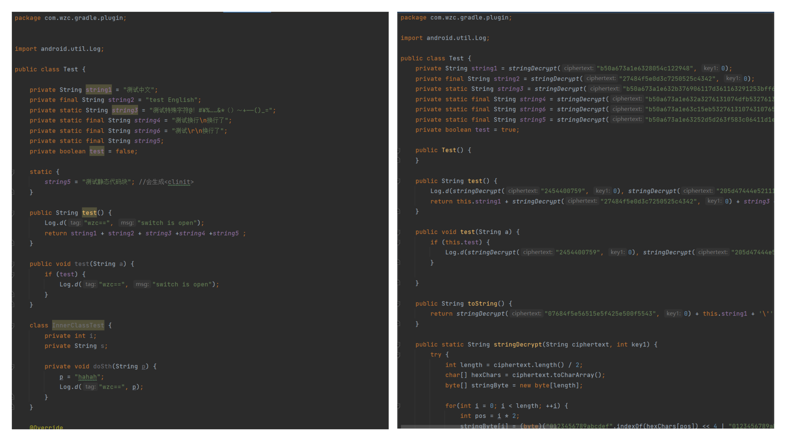

# 字符串混淆插件

1. 插件只能混淆java层代码
2. 插件只能在application类型的module中使用，插件会混淆application module所依赖的module和jar。所以请添加你要混淆的包名，否则所有第三方SDK都会被混淆

### 使用

#### 方式一

在项目跟目录下的`build.gradle`文件中添加以下代码

```groovy
buildscript {
    repositories {
        ...
        maven { url 'https://jitpack.io' }
    }
    dependencies {
        ...
        classpath 'com.github.wuzuchang:StringObfuscatedPlugin:2.0.0'
    }
}

allprojects {
    repositories {
        ...
        maven { url 'https://jitpack.io' }
    }
}
```

在app module下的`build.gradle`中添加以下代码

```groovy
plugins {
    id 'com.android.application'
    // 字符串混淆插件
    id 'com.wzc.string.obfuscate'
}
stringObfuscate{
    openLog = true
    // 添加需要混淆的包名
    packageName = ["com.wzc.gradle.plugin","com.wzc.test"] 
}
```

#### 方式二

下载[插件jar](https://github.com/wuzuchang/StringObfuscatedPlugin/raw/master/plugin_libs/StringObfuscatePlugin-1.0.0.jar)文件，复制到项目中的plugin_libs目录下(没有就新增目录)

```java
├── plugin_libs
│   └── StringObfuscatePlugin-1.0.0.jar
├── app
│   ├── ..
│   └── ..
└── module
│   ├── ..
│   └── ..
```

在项目根目录`build.gradle`中添加以下代码

```groovy
buildscript {
    repositories {
        ...
        flatDir {
            dirs 'plugin_libs'
        }
    }
    dependencies {
        ...
        classpath "com.wzc.string.obfuscate:StringObfuscatePlugin:1.0.0"
    }
}

allprojects {
    repositories {
        ...
        flatDir {
            dirs 'plugin_libs'
        }
    }
}
```

在app module下的`build.gradle`中添加以下代码

```groovy
plugins {
    id 'com.android.application'
    // 字符串混淆插件
    id 'com.wzc.string.obfuscate'
}
stringObfuscate{
    openLog = true
    // 添加需要混淆的包名
    packageName = ["com.wzc.gradle.plugin","com.wzc.test"] 
}
```

混淆前后对比


